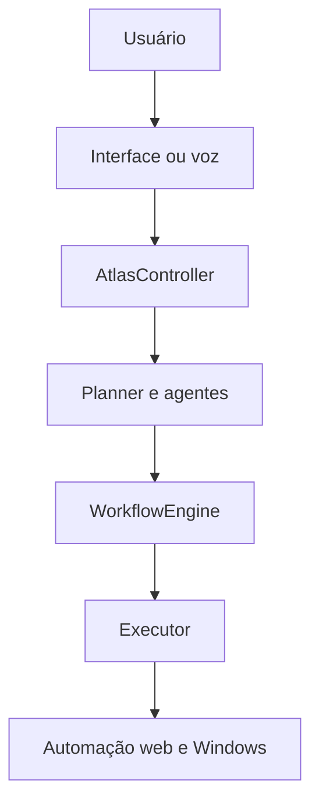

# Atlas — Assistente inteligente local


O **Atlas** é um assistente de inteligência artificial local criado por
**Ssamir Martins**. Ele interpreta comandos em português, planeja fluxos de
execução e realiza automações reais no navegador e no Windows, mantendo voz,
memória e contexto no próprio computador.

O projeto foi desenvolvido como uma plataforma modular de automação e IA,
com foco em privacidade, confiabilidade e evolução para cenários empresariais.

> Projeto em desenvolvimento ativo. A versão atual é voltada para Windows e
> execução local, não para uso em ambientes críticos de produção.

## Destaques técnicos

- arquitetura modular com Kernel, Controller, Planner, Workflow e Executor;
- interface corporativa construída com PySide6;
- entrada por texto, microfone e escuta contínua com interrupção de voz;
- integração local com modelos do Ollama;
- planejamento de comandos simples e compostos;
- automação com Playwright, teclado, mouse, processos, arquivos e janelas;
- workflows com condições, retries, telemetria e cancelamento cooperativo;
- agendamento de tarefas únicas e recorrentes;
- memória estruturada em SQLite com embeddings locais;
- recuperação híbrida por texto e similaridade semântica;
- captura automática, correção, exclusão reversível e restauração de memórias;
- registro central para agentes especializados;
- API HTTP local versionada com observabilidade, autenticação, comandos,
  workflows, cancelamento e auditoria persistente;
- memória operacional com sessões, linha do tempo e retomada segura;
- pesquisa web com múltiplas fontes, ranking e citações;
- piloto escolar com opt-in, filas e WhatsApp Business oficial em dry-run;
- provisionamento Windows com inventário mínimo, aprovação e dry-run;
- agentes consultivos para programação, radiologia, atacado e indústria;
- 620 testes automatizados e validação estática com Ruff.

## Arquitetura



O `AtlasController` é o ponto central de orquestração. O Planner e os agentes
produzem objetos `Action`, o `WorkflowEngine` controla o ciclo de execução e o
`AutomationEngine` concentra as operações reais. Essa separação permite testar
planejamento e regras de negócio sem abrir programas durante os testes.

Detalhes: [Arquitetura técnica](docs/ARCHITECTURE.md).

## Tecnologias

| Área | Tecnologias |
| --- | --- |
| Linguagem | Python 3.13 |
| Interface | PySide6 |
| IA local | Ollama |
| Navegador | Playwright |
| Voz | SpeechRecognition, Edge TTS e pyttsx3 |
| Persistência | SQLite e JSON |
| API local | FastAPI e Uvicorn |
| Qualidade | Pytest e Ruff |

## Funcionalidades

### Automação

- abrir programas, sites e projetos;
- pesquisar e interagir com páginas;
- clicar, preencher campos e pressionar teclas;
- criar e organizar arquivos e pastas;
- controlar processos e janelas;
- executar sequências de ações em ordem.

### Memória local

- guardar fatos explicitamente ou durante uma conversa;
- recuperar informações com perguntas semanticamente relacionadas;
- listar memórias com identificadores;
- corrigir, apagar de forma reversível e restaurar;
- consolidar duplicatas com regras de segurança;
- reduzir gradualmente a prioridade de fatos sem uso, sem exclusão automática.

### Workflows

- estados e contexto compartilhado;
- condições por etapa;
- tentativas automáticas;
- resultados padronizados;
- cancelamento com motivo, solicitante e horário;
- integração com TaskManager e Scheduler.

## Exemplos de comandos

```text
Atlas, abra o navegador
Atlas, pesquise carros usados e clique no primeiro resultado
Atlas, daqui a 10 minutos abra o CRM
Atlas, abra nosso projeto no VS Code
Atlas, lembre que minha cidade é Manaus
Atlas, liste minhas memórias
Atlas, pare a automação
```

## Requisitos

- Windows 10 ou 11;
- Python 3.13;
- [Ollama](https://ollama.com/) instalado e em execução;
- microfone, caso os recursos de voz sejam utilizados.

## Instalação rápida

Clone o repositório e entre na pasta:

```powershell
git clone https://github.com/ssamirchayen/atlas-assistente-inteligente.git
cd atlas-assistente-inteligente
```

Execute o instalador:

```powershell
powershell -ExecutionPolicy Bypass -File .\instalar.ps1
```

Ele cria a `.venv`, instala as dependências e prepara o Chromium usado pelo
Playwright.

### Instalação manual

```powershell
py -3.13 -m venv .venv
.\.venv\Scripts\python.exe -m pip install --upgrade pip
.\.venv\Scripts\python.exe -m pip install -r requirements.txt
.\.venv\Scripts\python.exe -m playwright install chromium
```

## Configuração

Crie a configuração local usando somente o arquivo de exemplo:

```powershell
Copy-Item .env.example .env
notepad .env
```

O arquivo `.env` real, as memórias, sessões e logs são ignorados pelo Git e não
devem ser publicados.

Consulte os modelos instalados:

```powershell
ollama list
```

## Execução

Interface gráfica:

```powershell
.\.venv\Scripts\python.exe gui_main.py
```

Modo principal pelo terminal:

```powershell
.\.venv\Scripts\python.exe main.py
```

Também estão disponíveis `executar_gui.bat` e `executar.bat`.

API local:

```powershell
.\.venv\Scripts\python.exe api_main.py
```

Antes da primeira execução, gere uma chave administrativa:

```powershell
.\.venv\Scripts\python.exe -c "import secrets; print(secrets.token_urlsafe(32))"
```

Copie o resultado para o `.env`:

```text
ATLAS_API_KEY=sua_chave_gerada
```

Com a API ativa, abra `http://127.0.0.1:8765/docs`. Use o botão **Authorize**
para informar a chave. `health` e `version` são públicos; os demais endpoints
exigem o cabeçalho `X-API-Key` e o escopo correspondente.

Para executar um comando, abra `POST /api/v1/commands`, selecione **Try it
out** e envie, por exemplo:

```json
{
  "command": "Atlas, liste minhas memórias"
}
```

O núcleo operacional é criado somente no primeiro comando e permanece em uma
única thread. Isso preserva a afinidade da sessão do navegador entre chamadas.
Execute somente uma instância operacional por vez: durante este teste, deixe a
interface gráfica fechada.

O `request_id` retornado também é o identificador do workflow. Ele pode ser
consultado em `GET /api/v1/workflows/{workflow_id}` e uma execução ativa pode
receber cancelamento cooperativo em
`POST /api/v1/workflows/{workflow_id}/cancel`.

A chave administrativa também pode consultar
`GET /api/v1/audit/events`. A trilha fica em `data/api_audit.db` e registra
somente metadados sanitizados. Chaves, comandos, respostas e motivos completos
não são armazenados em texto aberto. Veja a
[documentação de segurança e auditoria](docs/SPRINT20_API_SECURITY_AUDIT.md).

As sessões operacionais podem ser consultadas em `GET /api/v1/sessions` e
`GET /api/v1/sessions/{session_id}/timeline`. O plano de um workflow
interrompido fica disponível em `GET /api/v1/resumption`; sua execução exige
uma solicitação explícita em `POST /api/v1/resumption` e confirmação quando o
plano puder alterar estado externo. Consulte a
[documentação da Sprint 21](docs/SPRINT21_MEMORIA_OPERACIONAL.md).

## Testes e qualidade

```powershell
.\.venv\Scripts\python.exe -m pytest -q
.\.venv\Scripts\python.exe -m ruff check .
.\.venv\Scripts\python.exe -m compileall -q atlas main.py gui_main.py
```

Veja também o [guia de desenvolvimento](docs/DEVELOPMENT.md).

## Privacidade e segurança

O Atlas segue uma abordagem **local-first**:

- memória e sessão permanecem no computador do usuário;
- `.env`, bancos, logs e dados operacionais não entram no repositório;
- exclusões de memória são reversíveis;
- ações destrutivas passam por validações específicas;
- endpoints operacionais exigem chave e permissões por escopo;
- a API aceita somente hosts locais e adiciona cabeçalhos de segurança;
- a auditoria usa retenção limitada e redação de conteúdo sensível;
- o projeto não exige envio da memória pessoal para um serviço em nuvem.

Consulte [SECURITY.md](SECURITY.md) antes de publicar alterações.

## Roadmap

- [x] núcleo modular e automação local;
- [x] workflows, tarefas, agendamento e cancelamento;
- [x] interface corporativa e voz contínua;
- [x] memória semântica com ciclo de vida completo;
- [x] agentes empresariais para vendas, suporte de TI e RH;
- [x] base da API local, observabilidade, autenticação e permissões;
- [x] execução autenticada de comandos pela API;
- [x] consulta e cancelamento de workflows pela API;
- [x] auditoria persistente e segurança final da API local;
- [x] memória operacional, linha do tempo e retomada segura;
- [x] base segura de conectores e pesquisa web multifonte;
- [x] piloto escolar para CRM e WhatsApp Business oficial;
- [x] provisionamento Windows seguro e reversível;
- [x] agentes consultivos de programação, radiologia, atacado e indústria;
- [ ] painel de administração corporativo;
- [ ] adaptadores reais para CRM, e-mail e calendário.

## Autor

**Ssamir Martins** — estudante de Análise e Desenvolvimento de Sistemas e
criador do Atlas.

Este repositório demonstra competências em arquitetura de software, Python,
automação, IA local, testes, persistência, interfaces e engenharia de produto.

## Licença

Copyright © 2026 Ssamir Martins. Todos os direitos reservados.

O código é disponibilizado publicamente para avaliação técnica e portfólio.
Consulte o arquivo [LICENSE](LICENSE) para as condições de uso.
