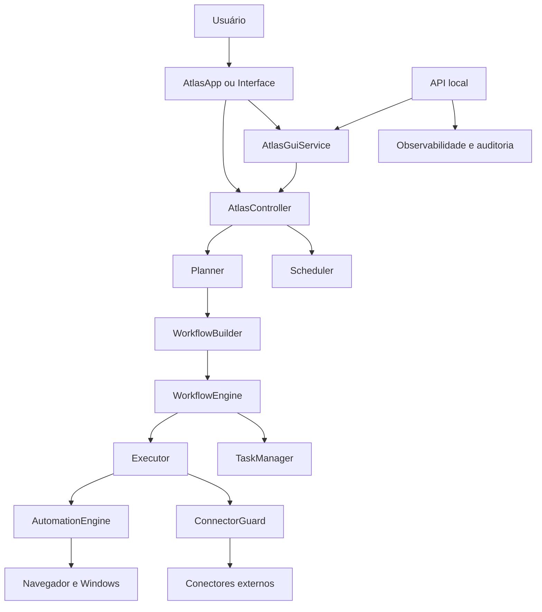
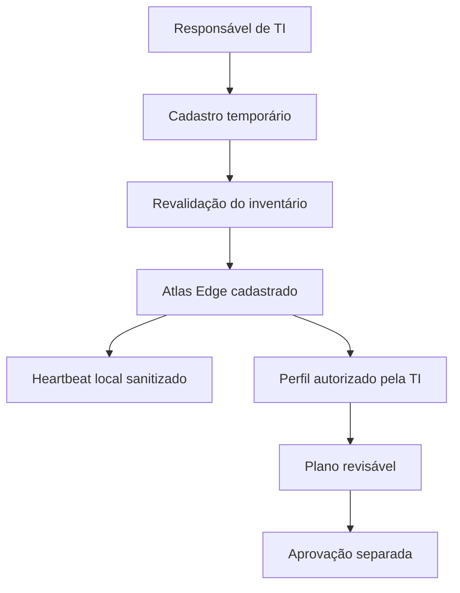

# Arquitetura técnica do Atlas

## Visão geral

O Atlas usa uma arquitetura modular. O `AtlasApp` controla o ciclo de entrada e
saída, enquanto o `AtlasController` é o ponto central para agendamento,
planejamento e execução.

## Componentes principais

| Componente | Responsabilidade |
| --- | --- |
| `atlas/core/app.py` | Entrada por voz/texto, resposta e ciclo da aplicação |
| `atlas/core/kernel.py` | Instancia e conecta as dependências |
| `atlas/core/controller.py` | Orquestra agendamento, planejamento e workflows |
| `atlas/gui/service.py` | Adapta o núcleo para a interface sem duplicar regras |
| `atlas/gui/window.py` | Exibe conversa, estado, métricas e controles |
| `atlas/api/` | Expõe contratos HTTP locais e versionados |
| `atlas/planner/` | Converte linguagem natural em ações estruturadas |
| `atlas/agents/` | Registra e seleciona agentes por domínio e prioridade |
| `atlas/connectors/` | Autoriza, limita e audita integrações externas |
| `atlas/internet/` | Pesquisa múltiplas fontes, ranqueia e cita resultados |
| `atlas/school/` | Piloto de CRM escolar, filas e WhatsApp Business |
| `atlas/provisioning/` | Planeja e aplica perfis Windows com aprovação |
| `atlas/workflow/` | Executa etapas, condições, retries e cancelamento |
| `atlas/planner/task_manager.py` | Controla o ciclo de vida das tarefas |
| `atlas/planner/executor.py` | Executa ações e padroniza resultados |
| `atlas/automation/` | Implementa ações reais no navegador e Windows |
| `atlas/scheduler/` | Analisa, persiste e dispara tarefas agendadas |
| `atlas/context/` | Mantém contexto recente da conversa |
| `atlas/memory/` | Persiste memória local em SQLite |
| `atlas/reasoning/` | Decide entre executar, perguntar e conversar |
| `atlas/voice/` | Controla captura, estados, síntese, interrupção e latência |

## Fluxo de execução imediata

1. `AtlasApp` recebe e normaliza o comando.
2. `AtlasController` verifica se o comando é um agendamento.
3. `Planner` produz uma lista de `Action`.
4. `WorkflowBuilder` converte ações em `WorkflowStep`.
5. `WorkflowEngine` cria tarefas e executa cada etapa.
6. `Executor` chama o `AutomationEngine`.
7. Resultados são devolvidos ao `AtlasApp` e registrados no contexto.

## Agentes especializados

Todo agente implementa o contrato `SpecializedAgent`, declara um
`AgentMetadata` e retorna apenas objetos `Action`. O `AgentRegistry` mantém o
catálogo, aplica prioridade determinística, permite restringir candidatos e
isola falhas não bloqueantes.

O Planner continua responsável pela ordem global do planejamento, mas não
precisa conhecer os detalhes internos de cada novo domínio. Os agentes atuais
são:

| Agente | Domínios principais | Prioridade |
| --- | --- | ---: |
| Browser Agent | navegador, web e pesquisa | 300 |
| Radiology Support Agent | qualidade e fluxo radiológico | 295 |
| Manaus Industrial Operations Agent | indústria, manutenção e qualidade | 292 |
| Wholesale Operations Agent | atacado, estoque, margem e logística | 288 |
| Programming Advisor Agent | criação, revisão e depuração de código | 282 |
| RH Agent | recrutamento, seleção e comunicação | 280 |
| IT Help Desk Agent | suporte, diagnóstico e infraestrutura | 275 |
| Sales Agent | vendas, atendimento comercial e leads | 250 |
| Coding Agent | código, desenvolvimento e projeto | 200 |
| Desktop Agent | desktop, Windows e aplicações | 100 |

Os quatro agentes de domínio da Sprint 22 são consultivos. Programação não
executa o código produzido; radiologia não recebe pixels nem emite diagnóstico
ou laudo; atacado não altera preços, pedidos ou saldos; indústria não controla
máquinas ou PLC. As respostas passam por `DomainAutomation` e retornam texto
para validação humana.

## Conectores empresariais

Antes de um agente ou workflow acessar um serviço externo, a operação deve ser
representada por um `ConnectorOperation` e avaliada pelo `ConnectorGuard`. O
risco e o escopo são obtidos do manifest registrado, impedindo que o comando
rebaixe sua própria classificação.

A camada aplica autorização, confirmação temporária, limite de lote, janela
móvel por minuto, idempotência e auditoria sem conteúdo privado. Operações
destrutivas permanecem bloqueadas por padrão. A Etapa 1 da Sprint 22 fornece
essa base sem realizar chamadas de rede; executores reais serão integrados de
forma incremental.

### Pesquisa web

O comando `internet.search` usa o `WebSearchService`. A Wikipédia em português
é a fonte padrão; Brave Search e SearXNG são opcionais. Cada adaptador retorna
um contrato comum, e falhas são isoladas por provedor.

Antes da consolidação, URLs não públicas são descartadas e parâmetros de
rastreamento são removidos. O ranking aplica relevância, posição, confiança,
corroboração e diversidade de domínio. A resposta final preserva citações e
uma trilha por fonte, mas nunca transforma texto recuperado em ação.

### Piloto escolar e WhatsApp Business

O pacote `atlas/school/` separa o contrato do CRM, a distribuição de leads e
o transporte oficial da Meta. O sistema específico da escola implementa
`SchoolCRM`; o Atlas não depende dos nomes de campos ou da API de um fornecedor.

Cada vendedor possui um `phone_number_id` corporativo verificado. O contato
só é preparado quando o lead possui prova de opt-in e o template está na lista
aprovada. A atribuição e o envio são operações de escrita externa avaliadas
pelo `ConnectorGuard`, exigindo confirmação temporária e idempotência. O modo
simulado é o padrão e os registros de entrega guardam apenas o hash do destino.

### Provisionamento de computadores

O pacote `atlas/provisioning/` separa inventário, planejamento, autorização e
execução. Perfis revisados declaram IDs exatos do WinGet e pastas relativas a
um workspace; não há suporte a scripts ou comandos livres. O inventário não
guarda hostname, usuário, serial ou catálogo global de programas.

Aplicar um plano é uma escrita externa protegida pelo `ConnectorGuard`. A
confirmação fica vinculada ao digest do plano e o inventário é revalidado antes
da execução. O executor opera em dry-run por padrão, usa `shell=False`, escopo
do usuário e remove somente pastas vazias criadas por ele quando uma etapa
posterior falha.

## Atlas Edge

O `ITProvisioningAgent` é a camada local da Sprint 23 para computadores
corporativos. A Etapa 1 mantém identidade aleatória, estado persistente,
cadastro supervisionado, inventário sanitizado e heartbeat local. A Etapa 2
adiciona um catálogo fechado de perfis e autorização de planos:

O estado fica em `data/edge/device.json`. Token e identidade do aprovador não
são persistidos; apenas o hash do responsável é guardado como evidência. O
agente não possui transporte remoto nesta sprint. Programas usam IDs exatos do
WinGet e pastas são relativas ao workspace corporativo. A referência do
funcionário e as identidades de quem solicita e aprova são convertidas em
SHA-256; o solicitante não pode aprovar o próprio plano. Perfil, vínculo e
inventário são revalidados antes da autorização.

A autorização da Etapa 2 é um recibo de curta duração. Na Etapa 3, esse recibo
é consumido uma única vez pela `EdgeTaskQueue`, persistida em
`data/edge/tasks.json`. Uma tarefa marcada como `running` durante uma interrupção
retorna a `queued` no reinício, com contador de recuperação e sem repetir uma
ação antes de revalidar o inventário.

Antes da execução, `EdgeExecutionService` recarrega o perfil oficial, compara
seu digest, captura novamente o inventário e reconstrói todas as etapas. Essa
comparação impede que uma edição manual do arquivo da fila adicione pacotes ou
configurações. A execução é sempre iniciada para um `task_id` explícito.

Os contratos da Etapa 3 cobrem programas, pastas, navegador, impressoras, VPN e
rede. Configurações específicas da empresa passam por
`ManagedSettingsAdapter`; o adaptador padrão bloqueia execução real. O modo
real também exige simultaneamente `ATLAS_EDGE_EXECUTION_ENABLED=1` e
`ATLAS_PROVISIONING_DRY_RUN=0`. A configuração padrão continua simulada.

Na Etapa 4, `GovernedEdgeService` coloca o `EdgePolicyEngine` antes de todas as
operações. Funções separadas de operador, aprovador, executor, auditor e
administrador são combinadas com allowlists exatas e isolamento por
organização. A auditoria fica em `data/edge/audit.db`, guarda somente hashes e
IDs seguros e possui retenção e quantidade limitadas.

A Etapa 5 fecha a Sprint 23 com `EmployeeOnboardingService`. Cada configuração
de novo funcionário passa a ser um workflow persistente em
`data/edge/onboardings.json`: plano, aprovação, fila, execução, cancelamento,
reconciliação após reinício e relatório operacional. Tokens de plano e recibos
de autorização permanecem somente em memória. Se o processo reiniciar antes da
fila, o onboarding exige novo plano; após entrar na fila, o `task_id` persistido
permite retomar com as revalidações da Etapa 3.

## Voz 2.0

`VoiceSession` continua sendo a fonte única de verdade para escuta,
processamento, fala e interrupção. `VoicePerformanceProfile` agrupa os tempos
de captura em perfis declarativos, enquanto `VoiceLatencyTracker` observa as
transições e mantém somente métricas agregadas em memória. Nenhuma transcrição
ou amostra de áudio é armazenada na telemetria.

## Fluxo de agendamento

1. `SchedulerParser` extrai comando, horário e recorrência.
2. `Scheduler` persiste um `ScheduledJob`.
3. `SchedulerWorker` identifica tarefas vencidas.
4. A tarefa retorna ao mesmo `AtlasController`, evitando pipelines paralelos.

## Cancelamento

O cancelamento é cooperativo e centralizado:

- `CancellationToken` guarda estado e auditoria;
- `WorkflowContext` compartilha o token;
- `WorkflowState` registra a etapa cancelada;
- `WorkflowEngine` verifica o token entre operações e retries;
- `AtlasController.cancel_active_workflow()` cancela a execução ativa;
- `TaskManager` marca a tarefa ativa como cancelada.

## Estado persistente

| Pasta | Conteúdo |
| --- | --- |
| `data/` | memória, última sessão e auditoria da API |
| `atlas_data/` | banco JSON do Scheduler |
| `logs/` | log operacional |

Essas pastas são estado local e não fazem parte do código-fonte distribuível.

## Compatibilidade e legado

Os arquivos vazios `atlas/actions/files.py`, `system.py` e `windows.py`, além de
`atlas/core/commands.py`, não participam do fluxo principal atual. Eles foram
mantidos temporariamente para evitar quebrar importações externas. Novas ações
devem ser implementadas em `atlas/automation/` e registradas no
`AutomationEngine`.

`main.py` inicia o modo principal por voz/texto no terminal. `gui_main.py`
inicia a interface gráfica conectada ao mesmo `AtlasController`.

## API local

`api_main.py` inicia um processo HTTP independente em `127.0.0.1`. Os endpoints
de saúde, versão e status permanecem leves: não instanciam `AtlasKernel`,
navegador, microfone, memória ou modelo de linguagem. O núcleo operacional é
carregado de forma preguiçosa somente no primeiro `POST /commands`.

Os comandos passam pelo mesmo `AtlasGuiService`, `AtlasController` e
`WorkflowEngine` utilizados pela interface gráfica. Um executor persistente de
uma única thread mantém criação, execução e encerramento do núcleo na mesma
thread. Essa decisão preserva a afinidade exigida pelo Playwright e permite
reutilizar a sessão do navegador em comandos consecutivos.

O runtime aceita apenas um comando por vez. Uma tentativa concorrente recebe
HTTP `409`; se a espera HTTP ultrapassar o limite configurado, a resposta é
`504`, mas o comando continua no núcleo até terminar ou ser cancelado. O valor
é configurado por `ATLAS_API_COMMAND_TIMEOUT`.

O contrato público começa em `/api/v1`. Mesmo com autenticação, a exposição
fora da máquina local permanece bloqueada até existirem transporte seguro,
rotação de credenciais e controles de implantação.

### Autenticação e autorização

Os endpoints operacionais usam uma chave no cabeçalho `X-API-Key`. A comparação
do segredo ocorre em tempo constante, chaves curtas são rejeitadas e a chave
nunca é devolvida pela API. O endpoint `/auth/me` informa apenas a identidade,
o papel e os escopos associados.

Existem dois perfis locais:

| Papel | Finalidade | Permissões |
| --- | --- | --- |
| `admin` | Operação completa do Atlas | status, comandos, workflows e auditoria |
| `monitor` | Dashboard somente de leitura | consulta de status |

Se nenhuma chave estiver configurada, os endpoints protegidos falham de forma
segura. `health` e `version` permanecem públicos para diagnóstico básico.

O endpoint `POST /api/v1/commands` exige o escopo `commands:execute`, disponível
somente para a chave administrativa. A chave de monitoramento recebe HTTP
`403`, mesmo sendo válida.

### Workflows e auditoria

Cada comando submetido pela API recebe um identificador que também representa
o workflow. O runtime mantém uma visão recente em memória para consultas de
estado e permite solicitar cancelamento cooperativo enquanto a execução está
ativa.

A trilha de auditoria é independente dessa visão em memória e persiste em
SQLite. Ela registra autenticações, submissões, resultados observados, timeouts
e cancelamentos. Conteúdo potencialmente privado é convertido em impressão
SHA-256 e tamanho antes da persistência. O banco nunca recebe a chave de API,
o comando completo, a resposta gerada ou o motivo completo do cancelamento.

Somente o papel `admin`, por meio do escopo `audit:read`, pode consultar os
eventos sanitizados. A aplicação limita a retenção por quantidade e idade,
restringe cabeçalhos `Host` à máquina local, desabilita cache nas respostas da
API e adiciona cabeçalhos contra interpretação indevida de conteúdo e uso em
frames.
