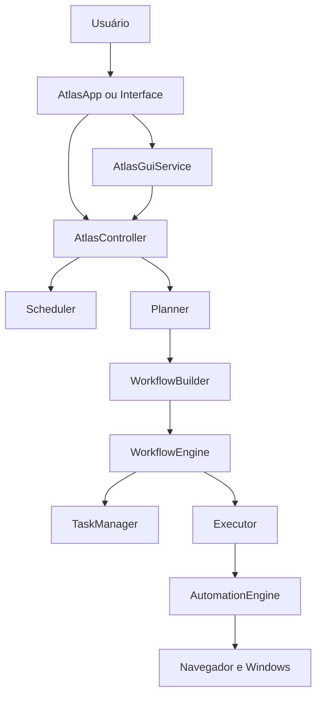

# Arquitetura técnica do Atlas

## Visão geral

O Atlas usa uma arquitetura modular. O `AtlasApp` controla o ciclo de entrada e
saída, enquanto o `AtlasController` é o ponto central para agendamento,
planejamento e execução.

## Componentes principais

| Componente | Responsabilidade |
| --- | --- |
| `atlas/core/app.py` | Entrada por voz/texto, resposta e ciclo da aplicação |
| `atlas/core/kernel.py` | Instancia e conecta as dependências |
| `atlas/core/controller.py` | Orquestra agendamento, planejamento e workflows |
| `atlas/gui/service.py` | Adapta o núcleo para a interface sem duplicar regras |
| `atlas/gui/window.py` | Exibe conversa, estado, métricas e controles |
| `atlas/planner/` | Converte linguagem natural em ações estruturadas |
| `atlas/agents/` | Registra e seleciona agentes por domínio e prioridade |
| `atlas/workflow/` | Executa etapas, condições, retries e cancelamento |
| `atlas/planner/task_manager.py` | Controla o ciclo de vida das tarefas |
| `atlas/planner/executor.py` | Executa ações e padroniza resultados |
| `atlas/automation/` | Implementa ações reais no navegador e Windows |
| `atlas/scheduler/` | Analisa, persiste e dispara tarefas agendadas |
| `atlas/context/` | Mantém contexto recente da conversa |
| `atlas/memory/` | Persiste memória local em SQLite |
| `atlas/reasoning/` | Decide entre executar, perguntar e conversar |

## Fluxo de execução imediata

1. `AtlasApp` recebe e normaliza o comando.
2. `AtlasController` verifica se o comando é um agendamento.
3. `Planner` produz uma lista de `Action`.
4. `WorkflowBuilder` converte ações em `WorkflowStep`.
5. `WorkflowEngine` cria tarefas e executa cada etapa.
6. `Executor` chama o `AutomationEngine`.
7. Resultados são devolvidos ao `AtlasApp` e registrados no contexto.

## Agentes especializados

Todo agente implementa o contrato `SpecializedAgent`, declara um
`AgentMetadata` e retorna apenas objetos `Action`. O `AgentRegistry` mantém o
catálogo, aplica prioridade determinística, permite restringir candidatos e
isola falhas não bloqueantes.

O Planner continua responsável pela ordem global do planejamento, mas não
precisa conhecer os detalhes internos de cada novo domínio. Os agentes atuais
são:

| Agente | Domínios principais | Prioridade |
| --- | --- | ---: |
| Browser Agent | navegador, web e pesquisa | 300 |
| RH Agent | recrutamento, seleção e comunicação | 280 |
| IT Help Desk Agent | suporte, diagnóstico e infraestrutura | 275 |
| Sales Agent | vendas, atendimento comercial e leads | 250 |
| Coding Agent | código, desenvolvimento e projeto | 200 |
| Desktop Agent | desktop, Windows e aplicações | 100 |

## Fluxo de agendamento

1. `SchedulerParser` extrai comando, horário e recorrência.
2. `Scheduler` persiste um `ScheduledJob`.
3. `SchedulerWorker` identifica tarefas vencidas.
4. A tarefa retorna ao mesmo `AtlasController`, evitando pipelines paralelos.

## Cancelamento

O cancelamento é cooperativo e centralizado:

- `CancellationToken` guarda estado e auditoria;
- `WorkflowContext` compartilha o token;
- `WorkflowState` registra a etapa cancelada;
- `WorkflowEngine` verifica o token entre operações e retries;
- `AtlasController.cancel_active_workflow()` cancela a execução ativa;
- `TaskManager` marca a tarefa ativa como cancelada.

## Estado persistente

| Pasta | Conteúdo |
| --- | --- |
| `data/` | memória e última sessão |
| `atlas_data/` | banco JSON do Scheduler |
| `logs/` | log operacional |

Essas pastas são estado local e não fazem parte do código-fonte distribuível.

## Compatibilidade e legado

Os arquivos vazios `atlas/actions/files.py`, `system.py` e `windows.py`, além de
`atlas/core/commands.py`, não participam do fluxo principal atual. Eles foram
mantidos temporariamente para evitar quebrar importações externas. Novas ações
devem ser implementadas em `atlas/automation/` e registradas no
`AutomationEngine`.

`main.py` inicia o modo principal por voz/texto no terminal. `gui_main.py`
inicia a interface gráfica conectada ao mesmo `AtlasController`.
