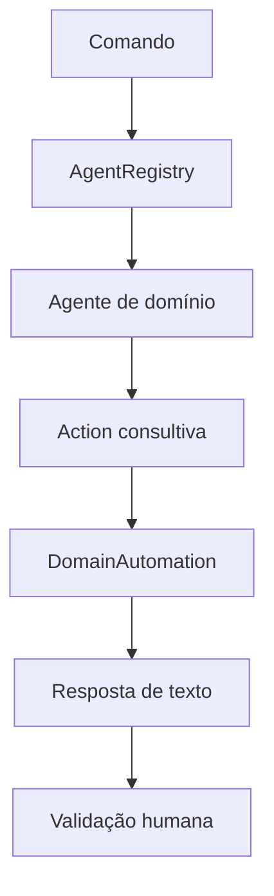

# Sprint 22 — Agentes consultivos de domínio

## Objetivo

A Etapa 5 adiciona quatro especialistas ao mesmo `AgentRegistry` usado pelo
Atlas. Eles transformam solicitações em ações estruturadas, mas não recebem
autoridade para executar código, diagnosticar pacientes, alterar estoque ou
controlar máquinas.

| Agente | Ação | Uso atual | Limite obrigatório |
| --- | --- | --- | --- |
| Programming Advisor | `domain.programming_assist` | criação, revisão, depuração e segurança | não executa o código nem inventa testes |
| Radiology Support | `domain.radiology_support` | checklist, fluxo e apoio clínico textual | sem pixels, patologia, diagnóstico ou laudo |
| Wholesale Operations | `domain.wholesale_analysis` | estoque, margem, demanda e logística | não altera preços, pedidos ou saldos |
| Manaus Industrial Operations | `domain.industry_analysis` | produção, qualidade, manutenção e segurança | não controla máquinas, PLC ou intertravamentos |

## Fluxo



O modelo local recebe somente um prompt textual nos domínios de programação,
atacado e indústria. Ele não recebe ferramentas. Radiologia usa respostas
determinísticas nesta versão para impedir que um modelo geral pareça analisar
um exame que nunca recebeu.

## Programação

O agente reconhece linguagens comuns e também pode trabalhar com outra
linguagem informada pelo usuário. Isso não significa conhecimento perfeito de
"todas as linguagens". A qualidade depende do modelo local, dos requisitos e
dos exemplos fornecidos.

Regras:

- código gerado é uma proposta para revisão;
- nenhuma resposta é executada automaticamente;
- resultados de testes não podem ser inventados;
- segredos e credenciais não devem ser enviados ao modelo;
- testes, análise estática e revisão de segurança continuam obrigatórios.

Essas regras seguem a ideia do
[Secure Software Development Framework do NIST](https://csrc.nist.gov/pubs/sp/800/218/final):
práticas de segurança precisam fazer parte do ciclo de desenvolvimento.

## Radiologia e saúde

O `RadiologySupportAgent` atual **não analisa imagens DICOM, JPG ou pixels**.
Ele oferece somente:

- checklist de qualidade técnica;
- organização de fila por critérios definidos pelo serviço;
- coleta de contexto textual para revisão;
- lembrete explícito de revisão profissional.

Ele não identifica patologias, decide urgência clínica, recomenda tratamento,
emite diagnóstico ou gera laudo. Qualquer evolução para análise de imagem
exigirá validação clínica, avaliação regulatória, governança de dados e
monitoramento de desempenho. As referências iniciais são a
[orientação de IA em saúde da OMS](https://www.who.int/publications/i/item/9789240029200)
e as
[perguntas e respostas da Anvisa sobre a RDC 657/2022](https://www.gov.br/anvisa/pt-br/assuntos/noticias-anvisa/2022/software-como-dispositivo-medico-perguntas-e-respostas/perguntas-respostas-rdc-657-de-2022-v1-01-09-2022.pdf).

## Comércio atacadista

O agente prepara análises e solicita os dados que faltam. Integrações reais com
ERP, WMS ou TMS deverão passar pelo `ConnectorGuard`, usar uma identidade com
escopo mínimo e exigir aprovação antes de qualquer escrita externa.

Nesta etapa ele não:

- compra produtos;
- muda preço ou margem cadastrada;
- movimenta ou reserva estoque;
- altera pedido, cliente ou rota.

## Indústria de Manaus

O agente cobre manutenção, produção, qualidade e segurança como apoio textual.
O contexto regional considera operações do Polo Industrial de Manaus, mas os
dados reais de cada fábrica ainda precisam ser integrados por adaptadores
específicos. A [Suframa](https://www.gov.br/suframa/pt-br/assuntos/industria)
é a referência pública inicial para o ambiente industrial regional.

O Atlas não se conecta a PLC, supervisório ou máquina nesta etapa. Também não
remove proteções nem substitui procedimentos de segurança. Qualquer futura
integração operacional deverá ser projetada de acordo com a
[NR-12 oficial](https://www.gov.br/trabalho-e-emprego/pt-br/acesso-a-informacao/participacao-social/conselhos-e-orgaos-colegiados/comissao-tripartite-partitaria-permanente/normas-regulamentadora/normas-regulamentadoras-vigentes/norma-regulamentadora-no-12-nr-12)
e validada por engenharia e segurança do trabalho.

## Teste manual sem efeitos externos

```powershell
.\.venv\Scripts\python.exe domain_agents_pilot.py
```

O piloto usa respostas locais de fallback e não acessa internet, arquivos,
estoque, prontuário ou equipamentos.
