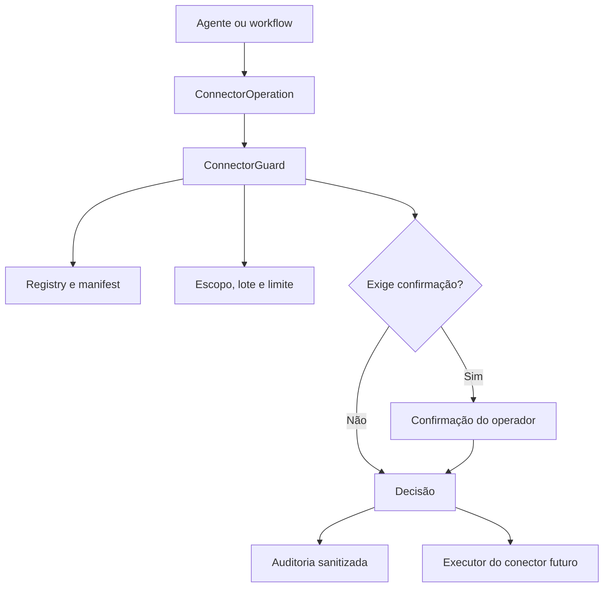

# Sprint 22 — Conectores empresariais e agentes de domínio

## Objetivo

A Sprint 22 prepara o Atlas para atuar em ambientes empresariais reais sem
permitir que cada integração invente suas próprias regras de segurança.

A Etapa 1 cria a camada `atlas/connectors/`. Ela ainda não acessa internet,
WhatsApp, CRM, equipamento industrial ou prontuário. Sua responsabilidade é
decidir, antes da chamada externa, se uma operação pode prosseguir.

## Garantias da Etapa 1

- catálogo explícito de conectores e capacidades;
- risco definido pelo manifest, nunca pelo comando ou pelo agente;
- autorização por identidade e escopo;
- confirmação temporária para escrita externa e dados sensíveis;
- bloqueio destrutivo por padrão;
- limite de lote e janela móvel por minuto;
- chave de idempotência para impedir envio ou alteração duplicada;
- confirmação vinculada ao conteúdo exato da operação;
- trilha de auditoria sem parâmetros, mensagens, telefones ou tokens;
- estruturas thread-safe para uso posterior pela API e pelos workflows.

## Fluxo de autorização

O executor real só será conectado em etapas posteriores. Receber uma decisão
`allowed` não executa nada por conta própria.

## Contratos principais

| Componente | Responsabilidade |
| --- | --- |
| `ConnectorCapability` | Declara escopo e risco fixo de uma capacidade |
| `ConnectorManifest` | Identidade, capacidades, lote e limite do conector |
| `ConnectorRegistry` | Catálogo central sem substituição silenciosa |
| `ConnectorOperation` | Solicitação imutável e identificável |
| `ConnectorPrincipal` | Identidade, papel e escopos do solicitante |
| `ConnectorGuard` | Avalia política e emite a decisão |
| `ConnectorAuditTrail` | Registra somente metadados seguros da decisão |

## Regras de risco

| Risco | Comportamento padrão |
| --- | --- |
| `read_only` | Permitido com escopo e limites válidos |
| `external_write` | Exige escopo, idempotência e confirmação |
| `sensitive` | Exige escopo e confirmação temporária |
| `destructive` | Bloqueado; só um manifest explícito pode habilitar |

Uma confirmação:

- expira por tempo;
- pertence a um único solicitante;
- vale apenas para a operação original;
- é consumida uma única vez;
- não é gravada na auditoria.

## Roadmap da Sprint 22

1. **Base segura de conectores** — concluída.
2. **Pesquisa web com múltiplas fontes** — concluída nesta entrega, com
   ranking, citação e rastreabilidade dos resultados.
3. **CRM escolar e WhatsApp Business** — concluída em modo piloto seguro, com
   contrato de CRM, filas por vendedor, opt-in, templates oficiais, aprovação
   humana, idempotência, limites e cliente da Cloud API.
4. **Provisionamento de computadores** — concluída em modo piloto seguro, com
   inventário mínimo, perfis declarativos, aprovação, dry-run, execução
   controlada, limpeza reversível e evidências.
5. **Agentes de domínio** — concluída em modo consultivo, com programação,
   apoio radiológico textual, atacado e indústria de Manaus; sem execução de
   código, diagnóstico, escrita empresarial ou controle de máquinas.

## Limites de segurança já definidos

- O agente de saúde não fará diagnóstico autônomo nem substituirá um
  profissional habilitado.
- Mensagens comerciais dependerão de consentimento, regras do canal e
  confirmação do operador.
- Configuração de máquinas terá princípio do menor privilégio e etapas
  reversíveis.
- Acesso à internet manterá origem, data e evidência das fontes.
- Código gerado será analisado e testado antes de qualquer execução.
