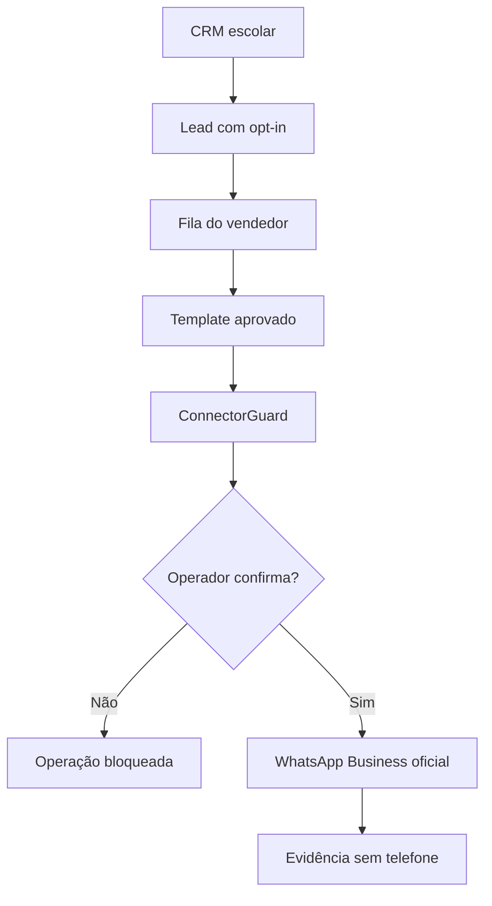

# Sprint 22 — Etapa 3: CRM escolar e WhatsApp Business

## Objetivo

Esta etapa cria o piloto seguro para uma escola distribuir leads aos
vendedores e enviar templates pela **WhatsApp Business Platform oficial**.
Ela não automatiza WhatsApp Web e não usa números pessoais sem autorização.

A opção escolhida para a operação é um número corporativo verificado para
cada vendedor. O Atlas relaciona `seller_id` a `phone_number_id` e sempre usa
o número do responsável atual pelo lead.

## O que foi implementado

- contrato `SchoolCRM` para adaptar qualquer sistema escolar;
- CRM em memória somente para testes e demonstrações sem dados reais;
- modelos de lead, vendedor, opt-in, template e entrega;
- distribuição pela menor fila ativa, com capacidade por vendedor;
- telefone no formato E.164 e número corporativo `phone_number_id`;
- listagem operacional com telefone mascarado;
- bloqueio quando o opt-in é desconhecido, revogado ou o contato é proibido;
- revalidação do consentimento imediatamente antes do envio;
- somente templates presentes na lista aprovada;
- aprovação humana de atribuições e mensagens;
- idempotência contra envio duplicado;
- limite máximo de lote em 20, sem disparo paralelo automático;
- cliente oficial da Cloud API sem redirecionamentos e com resposta limitada;
- modo `dry-run` ativado por padrão;
- registro de entrega sem armazenar o telefone em texto aberto.

## Fluxo



## Teste seguro sem Meta

O script abaixo usa somente dados fictícios e sempre instancia o cliente
`DryRunWhatsAppClient`, independentemente do `.env`:

```powershell
cd C:\Atlas_OFICIAL
.\.venv\Scripts\python.exe school_pilot.py
```

Confirme as duas operações digitando `SIM` em letras maiúsculas. Ao final,
o terminal deve informar que nenhuma mensagem real foi enviada.

## Configuração para a futura homologação real

Comece com um número de teste da Meta e leads fictícios ou anonimizados. Para
cada vendedor, cadastre um número corporativo no portfólio empresarial da
escola e grave o `phone_number_id` retornado pela Meta no adaptador do CRM.

No arquivo `.env` local:

```dotenv
ATLAS_WHATSAPP_DRY_RUN=1
ATLAS_WHATSAPP_GRAPH_API_VERSION=v26.0
ATLAS_WHATSAPP_TIMEOUT=15
ATLAS_WHATSAPP_MAX_BATCH_SIZE=20
ATLAS_WHATSAPP_OPERATIONS_PER_MINUTE=20
# ATLAS_WHATSAPP_ACCESS_TOKEN=segredo_local
```

O token não pertence ao GitHub, ao CRM ou aos dados do lead. Ele deve ser um
segredo local com as permissões mínimas necessárias. Antes de mudar
`ATLAS_WHATSAPP_DRY_RUN` para `0`, a escola ainda precisa:

1. possuir portfólio empresarial e WhatsApp Business Account;
2. verificar e registrar os números corporativos;
3. aprovar o template `school_lead_followup` na Meta;
4. documentar a origem do opt-in dos titulares;
5. implementar o adaptador do sistema escolar que segue `SchoolCRM`;
6. homologar com o número de teste e aprovação humana;
7. configurar webhooks assinados para estados de entrega.

## Limites desta entrega

O Atlas já possui o contrato para o sistema específico, mas nenhum CRM de
terceiro foi escolhido pelo usuário. Por isso, esta entrega não inventa URL,
campos ou credenciais de um fornecedor. Quando a escola informar qual sistema
usa e disponibilizar sua documentação oficial, um adaptador separado deverá
traduzir esse sistema para `SchoolCRM`.

O cliente de envio real está implementado, mas não deve ser ativado em
produção antes da homologação, dos webhooks e da revisão das políticas e
obrigações aplicáveis à instituição.
