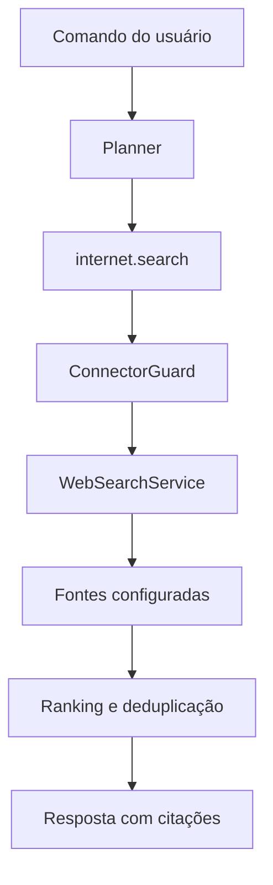

# Sprint 22 — Etapa 2: pesquisa web mult fonte

## Objetivo

Permitir que o Atlas obtenha resultados atuais de fontes diferentes sem
confundir conteúdo externo com uma instrução executável. Toda consulta passa
pela política criada na Etapa 1 e retorna origem, URL, posição e evidência da
consulta.

## Fontes disponíveis

| Fonte | Ativação | Finalidade |
| --- | --- | --- |
| Wikipédia em português | Padrão, sem chave | Referência enciclopédica |
| Brave Search | Chave opcional | Índice amplo da web |
| SearXNG | URL opcional | Metapesquisa própria ou empresarial |

A ausência de Brave ou SearXNG não impede o uso da Wikipédia. A falha de uma
fonte também não descarta resultados válidos das demais.

## Fluxo



Os provedores nunca devolvem ações ao Planner. Eles devolvem apenas dados de
pesquisa, que passam por validação antes de aparecerem na resposta.

## Segurança e privacidade

- consulta autorizada pelo escopo `internet:search`;
- auditoria recebe somente o SHA-256 da consulta, nunca seu texto;
- API keys ficam exclusivamente no `.env`;
- cliente HTTP não segue redirecionamentos;
- corpo JSON limitado a 2 MB;
- timeout configurável;
- URLs com credenciais, esquemas não web, localhost e IP privado são removidas;
- resultados que falsificam a identidade do provedor são descartados;
- conteúdo recuperado não é executado pelo Atlas;
- SafeSearch permanece ativado por padrão.

## Ranking

O ranking é determinístico e combina:

1. correspondência das palavras da consulta;
2. posição original em cada fonte;
3. peso declarado do provedor;
4. confirmação do mesmo endereço por fontes diferentes.

Parâmetros de rastreamento conhecidos são removidos antes da deduplicação.
Cada domínio recebe no máximo dois resultados por padrão, impedindo que uma
única origem domine a resposta.

## Comandos

Pesquisa mult fonte, sem abrir o navegador:

```text
Atlas, pesquise na internet por indústrias de Manaus
Atlas, consulte em várias fontes sobre inteligência artificial na saúde
```

O comportamento antigo continua disponível:

```text
Atlas, pesquise no Google carros usados
```

Nesse caso, o Atlas abre a pesquisa no navegador para permitir interação e
cliques posteriores.

## Configuração opcional

```env
ATLAS_INTERNET_SEARCH=1
ATLAS_INTERNET_SEARCH_TIMEOUT=8
ATLAS_INTERNET_SEARCH_MAX_PER_DOMAIN=2
ATLAS_INTERNET_SEARCH_RATE_LIMIT=30

# Opcional
ATLAS_BRAVE_SEARCH_API_KEY=sua_chave

# Opcional: instância própria
ATLAS_SEARXNG_URL=https://busca.suaempresa.com
ATLAS_SEARXNG_ALLOW_PRIVATE=0
```

Uma instância privada HTTP exige `ATLAS_SEARXNG_ALLOW_PRIVATE=1`. Endpoints
remotos públicos continuam obrigados a usar HTTPS.

## Teste manual

Com a internet disponível:

```powershell
.\.venv\Scripts\python.exe search_web.py "indústrias de Manaus" --limit 5
```

O resultado deve exibir itens numerados como `[1]`, `[2]` e suas URLs.
