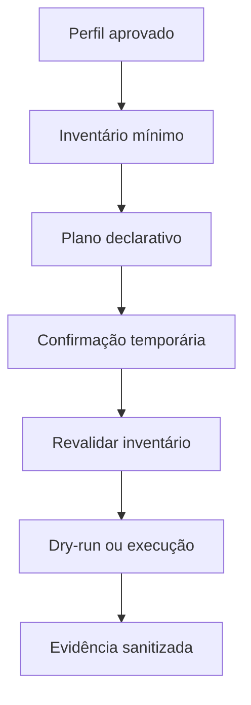

# Sprint 22 — Provisionamento seguro de computadores

## Objetivo

Esta etapa permite ao Atlas preparar planos declarativos para computadores
Windows novos, com inventário mínimo, aprovação humana, modo simulado e
evidências sanitizadas. O Atlas não recebe comandos PowerShell arbitrários,
não solicita elevação e não altera políticas do Windows.

O provisionamento real permanece desativado por padrão:

```text
ATLAS_PROVISIONING_DRY_RUN=1
```

## Perfis iniciais

| Perfil | Pacotes exatos | Pastas no workspace |
| --- | --- | --- |
| `school-sales` | Chrome, Teams e Acrobat Reader | `Escola/Leads` e `Escola/Documentos` |
| `school-helpdesk` | Pacotes de vendas, 7-Zip e PowerToys | `TI/Atendimentos` |

Os pacotes são referenciados por IDs exatos do WinGet e fontes autorizadas.
Novos perfis devem ser adicionados no código e revisados; texto do usuário não
é convertido em script ou linha de comando.

## Fluxo de segurança



1. O inventário coleta versão do sistema, arquitetura, hash do dispositivo e
   presença somente dos pacotes declarados.
2. O planner gera apenas criação de pasta relativa e instalação de pacote
   WinGet conhecido.
3. O `ConnectorGuard` exige identidade, escopos, limite de lote, idempotência
   e confirmação para aplicação.
4. Antes da execução, o inventário é coletado novamente. Qualquer mudança
   invalida o plano aprovado.
5. O executor usa argumentos separados, `shell=False`, IDs exatos, escopo do
   usuário e sem elevação.
6. Pastas vazias criadas nesta execução são removidas se uma etapa posterior
   falhar. Pacotes instalados não são desinstalados automaticamente.

## Privacidade

O inventário não persiste hostname, usuário, número de série, endereço IP,
lista global de programas ou chaves. A evidência contém hashes, IDs internos,
estado das etapas e duração.

## Execução real

O piloto `provisioning_pilot.py` é sempre simulado, independentemente do
arquivo `.env`. Para habilitar o executor real em uma integração futura, a
organização precisa primeiro revisar os perfis, o workspace e a política de TI,
então configurar:

```text
ATLAS_PROVISIONING_DRY_RUN=0
ATLAS_PROVISIONING_WORKSPACE=C:\Atlas_Workspace
```

Essa configuração não deve ser usada em computadores de produção sem teste em
máquina descartável, backup, supervisão de TI e plano de recuperação.

## Limites conhecidos

- somente Windows 10/11 com WinGet;
- instalações são executadas no escopo do usuário;
- sem ingresso em domínio, criação de contas, alteração do registro, drivers,
  políticas de grupo, antivírus ou credenciais;
- sem execução por linguagem natural ou pela interface gráfica nesta etapa;
- instalação de pacote é tratada como não reversível automaticamente.
