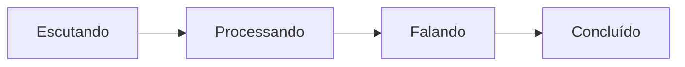

# Sprint 23 — Voz 2.0 e velocidade

## Etapa 1 — Perfil de desempenho e telemetria

A primeira etapa cria uma linha de base mensurável antes das otimizações de
reconhecimento e síntese. O Atlas passa a ter perfis declarativos e um rastreador
local para o ciclo completo:



O `VoiceLatencyTracker` calcula o tempo de cada estado usando relógio monotônico.
Ele mantém no máximo 50 ciclos em memória e registra somente duração, resultado
e presença de reconhecimento. Transcrição, resposta, motivo completo e áudio
não entram nas métricas.

## Perfis

| Perfil | Uso recomendado | Pausa final | Calibração | Timeout |
| --- | --- | ---: | ---: | ---: |
| `balanced` | comportamento compatível atual | 1,70 s | 1,00 s | 10 s |
| `fast` | resposta curta e ambiente controlado | 0,90 s | 0,50 s | 6 s |
| `accurate` | fala pausada ou ambiente mais difícil | 2,00 s | 1,50 s | 12 s |

O padrão continua sendo `balanced`, portanto instalar esta etapa não muda o
ritmo atual. Para ativar o perfil rápido, altere somente o `.env` local:

```text
ATLAS_VOICE_PROFILE=fast
```

Reinicie o Atlas depois da alteração. Se ele começar a encerrar a frase antes
de você terminar, use novamente `balanced` ou escolha `accurate`.

## Acesso às métricas

Durante a execução, o snapshot pode ser consultado internamente por:

```python
kernel.speech.performance_snapshot()
```

Exemplo de estrutura:

```json
{
  "profile": "fast",
  "cycles": 3,
  "completed": 3,
  "interrupted": 0,
  "errors": 0,
  "average_total_ms": 2840.5,
  "maximum_total_ms": 3310.2
}
```

Os valores serão aproveitados nas próximas etapas para comparar reconhecimento,
resposta do modelo e síntese sem depender de impressão subjetiva.

## Limite desta etapa

Esta etapa reduz janelas de espera quando o perfil `fast` é escolhido, mas ainda
não troca o motor de reconhecimento nem faz streaming de áudio. Naturalidade da
voz, cache de síntese, início antecipado da reprodução e resposta instantânea
serão tratados nas próximas etapas da Sprint 23.
